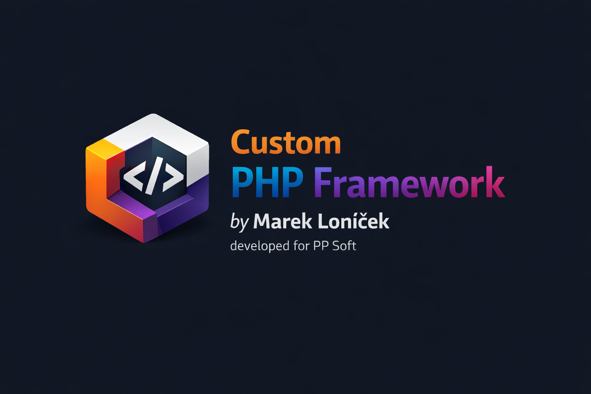

# 💎 My Custom PHP Framework™

<p align="center">
  
</p>

<p align="center">
  <b>Personal custom PHP framework</b><br>
  Experimental • Educational • From scratch
</p>

---

## 📌 About

This is my **personal custom PHP framework**, built for **learning, testing, and experimenting** with core backend concepts.

<table>
<tr>
<td>

### 🎯 Goals
<ul>
  <li>Understand PHP internals</li>
  <li>Build MVC architecture</li>
  <li>Custom routing & DI</li>
  <li>No heavy frameworks</li>
</ul>

</td>
<td>

### ⚠️ Status
<ul>
  <li>Not production-ready</li>
  <li>Breaking changes allowed</li>
  <li>Refactoring playground</li>
</ul>

</td>
</tr>
</table>

---

## 🧱 Architecture

<ul>
  <li>📦 Core
    <ul>
      <li>🔀 Router</li>
      <li>🎮 Controller</li>
      <li>🧩 Dependency Injection</li>
    </ul>
  </li>
  <li>🖼️ MVC
    <ul>
      <li>📄 Models</li>
      <li>🧠 Business Logic</li>
      <li>🎨 Views</li>
    </ul>
  </li>
</ul>

---

## 🛠️ Tech Stack

<table>
<tr><th>Layer</th><th>Technology</th></tr>
<tr><td>Backend</td><td>PHP 8+</td></tr>
<tr><td>Frontend</td><td>HTML5, CSS3</td></tr>
<tr><td>Versioning</td><td>Git</td></tr>
</table>

---

## 📂 Project Philosophy

```text
Framework
 ├─ Core
 │   ├─ Router
 │   ├─ Container
 │   └─ Kernel
 ├─ App
 │   ├─ Model
 │   ├─ View
 │   └─ Controller
 └─ Public
     ├─ index.php
     └─ assets
